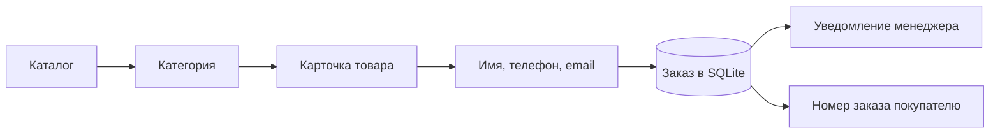

# GYM RATS — Telegram Shop

Асинхронный Telegram-бот спортивного магазина: каталог товаров, оформление заявки и уведомление менеджера прямо в Telegram.


Проект показывает полный сценарий небольшого магазина: покупатель выбирает товар, оставляет контакты и получает номер заказа. Менеджер получает заявку с товаром, ценой и контактами покупателя. Согласование покупки и оплата происходят вне бота.

## Возможности

- Каталог с двумя уровнями: раздел → категория / бренд → товар.
- Карточка товара с описанием, ценой в рублях и необязательной фотографией.
- Пошаговое оформление: имя → телефон → email.
- Проверка ввода и нормализация российского номера телефона в формат `+7XXXXXXXXXX`.
- Подсказки с сохранёнными контактами для повторных покупателей.
- Сохранение заказов в SQLite с уникальным номером и снимком товара, цены и контактов.
- Защита от повторного создания одного заказа при повторной отправке email.
- Уведомление менеджера и сохранение признака доставки уведомления.
- Независимое оформление для разных покупателей; команды отмены доступны на любом шаге.

## Как это работает



Обработчики работают в личных чатах. Кнопки содержат идентификаторы разделов и товаров, поэтому навигация не зависит от действий других покупателей. Диалог оформления реализован через [FSM aiogram](https://docs.aiogram.dev/en/latest/dispatcher/finite_state_machine/index.html). Заказ и данные покупателя сохраняются одной транзакцией; повторное создание ограничено уникальным ключом оформления и [SQLite upsert](https://docs.sqlalchemy.org/en/20/dialects/sqlite.html#insert-on-conflict-upsert).

## Стек

| Компонент | Назначение |
| --- | --- |
| Python 3.11+ | Асинхронное приложение на `asyncio` |
| aiogram 3 | Telegram Bot API, маршрутизация и FSM |
| SQLAlchemy 2 + aiosqlite | Асинхронный доступ к SQLite |
| unittest | Тестирование маршрутов, оформления и базы |
| Ruff | Проверка стиля, импортов и форматирования |
| GitHub Actions | Автоматический запуск проверок при push и pull request |

Прямые зависимости закреплены в `requirements.txt`; инструменты разработки — в `requirements-dev.txt`.

## Быстрый старт

### 1. Установка

Клонируйте репозиторий и откройте его корневую папку. Создайте виртуальное окружение:

```bash
python -m venv .venv
```

Windows PowerShell:

```powershell
.\.venv\Scripts\Activate.ps1
```

Linux / macOS:

```bash
source .venv/bin/activate
```

Установите зависимости:

```bash
python -m pip install -r requirements.txt
```

### 2. Настройки

Создайте бота через [@BotFather](https://t.me/BotFather) и задайте переменные окружения.

| Переменная | Обязательна | Значение |
| --- | --- | --- |
| `BOT_TOKEN` | Да | Токен Telegram-бота |
| `ADMIN_CHAT_ID` | Да | Ненулевой числовой ID личного чата менеджера или группы; для группы может быть отрицательным |
| `DATABASE_URL` | Нет | SQLite URL; по умолчанию `db.sqlite3` в корне проекта независимо от текущей рабочей папки |

Windows PowerShell:

```powershell
$env:BOT_TOKEN = "YOUR_BOT_TOKEN"
$env:ADMIN_CHAT_ID = "123456789"
```

Linux / macOS:

```bash
export BOT_TOKEN="YOUR_BOT_TOKEN"
export ADMIN_CHAT_ID="123456789"
```

Менеджер должен сначала открыть личный чат с ботом и отправить `/start`, либо добавить бота в целевую группу с разрешением отправлять сообщения. `ADMIN_CHAT_ID` — именно числовой ID, не `@username`.

Файл [.env.example](.env.example) служит образцом. Приложение читает окружение процесса и **не загружает `.env` автоматически**. Старый локальный `config.py` больше не используется.

### 3. Демокаталог и запуск

Для первого знакомства заполните пустую базу демонстрационными товарами:

```bash
python -m app.seed
python run.py
```

Демокаталог содержит два раздела и два товара без фотографий. Повторный запуск заполнения ничего не меняет, если хотя бы одна таблица каталога уже содержит данные. Токен для заполнения базы не нужен.

Откройте своего бота в Telegram и отправьте `/start`. Приложение использует long polling; публичный сервер и webhook для локального запуска не требуются. Остановка — `Ctrl+C`.

## Команды

| Команда | Действие |
| --- | --- |
| `/start` | Главное меню; сброс незавершённого оформления |
| `/shop` | Каталог; сброс незавершённого оформления |
| `/help` | Подсказка без потери текущего шага |
| `/cancel` | Отмена незавершённого оформления |

Кнопка «🛍Каталог» также открывает каталог. Возврат к просмотру каталога через inline-кнопки прекращает текущий диалог оформления.

## Структура

```text
telegram_shop/
├── run.py                  # Запуск, polling и освобождение ресурсов
├── app/
│   ├── config.py           # Настройки окружения
│   ├── handlers.py         # Команды, каталог, оформление
│   ├── keyboards.py        # Построение клавиатур без запросов к БД
│   ├── validation.py       # Проверка имени, телефона и email
│   ├── seed.py             # Демокаталог для пустой базы
│   └── database/
│       ├── models.py       # Пользователи, каталог и заказы
│       └── requests.py     # Запросы и транзакции
├── tests/                  # Автоматические тесты без Telegram API
├── docs/REVIEW.md           # Результаты анализа и проверки
├── .github/workflows/      # CI
├── .env.example
├── requirements.txt
├── requirements-dev.txt
└── pyproject.toml          # Настройки Ruff
```

## Данные и каталог

При запуске автоматически создаются отсутствующие таблицы:

- `maincategories`, `categories`, `items` — каталог;
- `users` — последние контактные данные покупателей;
- `orders` — заявки, снимок данных на момент оформления и флаг `notified`.

`price` хранится целым числом рублей, `picture` — необязательные байты изображения. Для своих товаров используйте SQLAlchemy-модели или редактор SQLite; интерфейс управления каталогом пока не реализован. Соблюдайте связи категорий и товаров, длины полей моделей и неотрицательные цены.

Схема прежних таблиц сохранена для совместимости: ссылки `main_category` остаются строковыми. При первом запуске обновлённой версии добавляется таблица `orders`. `create_all` не выполняет миграции существующих столбцов. Перед обновлением рабочей базы сделайте резервную копию.

Если сообщение менеджеру не доставлено, заказ сохраняется с `notified = 0`, а в журнал записывается номер заказа. Такие заявки нужно проверять вручную, например запросом в редакторе SQLite:

```sql
SELECT id, created_at, item_name, price
FROM orders
WHERE notified = 0
ORDER BY id;
```

Автоматической повторной доставки пока нет. Если Telegram принял сообщение, но сохранение флага завершилось ошибкой, заявка также может остаться с `notified = 0` — перед повторной отправкой проверьте чат менеджера.

## Проверки

```bash
python -m pip install -r requirements-dev.txt
python -m unittest discover -s tests -v
python -m ruff check .
python -m ruff format --check .
```

Тесты используют отдельные временные SQLite-базы и подменённый транспорт Telegram. Настоящий токен и доступ к сети для них не нужны. Они проверяют маршрутизацию aiogram, полный заказ, повторного покупателя, параллельные действия, ошибки ввода, команды, отсутствующие товары, сбои сохранения и уведомления, а также запуск с чистой базой.

CI настроен на Python 3.11 и 3.14, Windows и Linux. Локальная проверка описана в [отчёте](docs/REVIEW.md).

## Границы проекта

- Одна заявка содержит один товар. Корзины, количества, доставки и онлайн-оплаты нет.
- Остатки и варианты размеров не учитываются; детали покупки уточняет менеджер.
- Промежуточные шаги FSM хранятся в памяти и сбрасываются при перезапуске. Сохранённые заказы остаются в SQLite.
- Проект рассчитан на один процесс бота. Для нескольких экземпляров понадобятся общее хранилище FSM и распределённая изоляция событий.
- Поддерживается SQLite; смена `DATABASE_URL` на PostgreSQL не поддерживается текущими запросами upsert.
- Каталог не разбит на страницы; текущий интерфейс рассчитан на небольшое число товаров.

## Секреты и персональные данные

Не публикуйте токен, рабочую базу и выгрузки контактов. Они исключены из Git вместе с локальными сборками и Python-кешем. Заказы содержат персональные данные, поэтому доступ к базе и резервным копиям должен быть ограничен владельцем приложения.

Если токен когда-либо попадал в коммиты, перевыпустите его через BotFather: добавление файла в `.gitignore` не удаляет секрет из истории Git.
